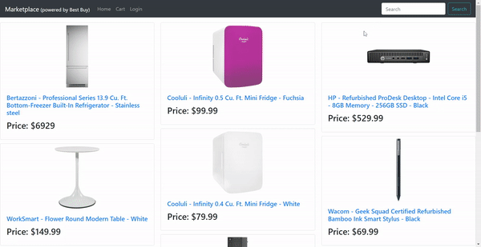

# Marketplace

A simulated online marketplace. This is a full stack application that leverages the Best Buy API. It allows you to search for items, and add them to your cart.

## Deployed Link

https://powerful-fjord-83367.herokuapp.com/

## Code Snipets 

```jsx
const reducer = (state, action) => {
  switch (action.type) {
  case SET_SEARCH_TERM:
    return {
      ...state,
      searchTerm: action.searchTerm
    };
  case SET_CURRENT_PRODUCT:
    return {
      ...state,
      currentProduct: action.product,
      loading: false
    };

  case UPDATE_PRODUCT_LIST:
    return {
      ...state,
      productList: [...action.productList],
      loading: false
    };

  case ADD_PRODUCT:
    return {
      ...state,
      cartList: [action.product, ...state.cartList],
    };

  case REMOVE_PRODUCT:
    return {
      ...state,
      cartList: state.cartList.filter((product) => {
        return product.sku !== action.sku; 
      })
    };

  case UPDATE_CART_LIST:
    return {
      ...state,
      cartList: [...state.cartList],
      loading: false
    };
  
  case LOADING:
    return{
        ...state,
        loading: true
    };

  default:
    return state;
  }
};

const StoreProvider = ({ value = [], ...props }) => {
    const [state, dispatch] = useReducer(reducer, {
      searchTerm: "top products",
      productList: [],
      currentProduct: {
        sku: 0,
        _id: 0,
        title: "",
        seller: "",
        price: 0,
        description: "",
        thumbnail_url: "",
      },
      cartList: [],
      loading: false
    });
  
    return <Provider value={[state, dispatch]} {...props} />;
  };
  
  const useStoreContext = () => {
    return useContext(StoreContext);
  };
```
The global state for this app utilizes a reducer hook. The reducer function uses a switch statement to handle all the different actions that modify the state. `searchTerm` is the query sent to the Best Buy API. `productList` stores the results from the API search. `currentProduct` reflects the product the user clicked on from the result list. `cartList` stores the list of products added to the cart. `loading` is used to conditionally render the results to the page. 

```jsx
<div className="mt-3">
    {state.loading ? (<Spinner animation="border" className="loading"/>) : (
    <Container className="mb-5">
        <Image src={state.currentProduct.thumbnail_url} className="mx-auto product-info-image"/>
        <h3 className="mt-2 text-center">{state.currentProduct.title}</h3>
        <h6 className="mt-w text-center">Sold by: {state.currentProduct.seller}</h6>
        <h3 className="text-center"><span className="bg-dark text-white px-2">${state.currentProduct.price}</span></h3>
        <hr/>
        <h5>Product Description:</h5>
        <p>{state.currentProduct.description}</p>
        {checkCartList() ? (
            <Button variant="danger" size="lg" onClick={()=>removeFromCart()}>Remove from Cart</Button>
        ) : (
            <Button variant="success" size="lg" onClick={()=>addToCart()}>Add to Cart</Button>
        )}
    </Container>
    )}
</div>
```
This is the code that is rendered on the product page. There are two conditional renders. The first checks the `loading` state. If `loading` is true, a spinner is rendered, otherwise the product info is rendered. The second conditional render checks if the current object has been added to the cart list. If it hasn't, the `Add to Cart` button is rendered, otherwise the `Remove from Cart` button is rendered.
## Live Demo



## Built With
* [React](https://reactjs.org/)
* [React-Bootstrap](https://react-bootstrap.netlify.com/)
* [MongoDB](https://www.mongodb.com/)
* [Mongoose](https://www.npmjs.com/package/mongoose)
* [Bootstrap](https://getbootstrap.com/)
* [node.js](https://nodejs.org/en/)
* [HTML](https://developer.mozilla.org/en-US/docs/Web/HTML)
* [CSS](https://developer.mozilla.org/en-US/docs/Web/CSS)
* [Javascript](https://developer.mozilla.org/en-US/docs/Web/JavaScript)
* [Git](https://git-scm.com/)
* [GitHub](https://github.com/)
* [VSCode](https://code.visualstudio.com/)

## Author

**Yalí Miranda** 

* [Github](https://github.com/yjmiranda)
* [LinkedIn](https://www.linkedin.com/in/yal%C3%AD-miranda-8b4b94199/)
* [Portfolio](https://yali-miranda-portfolio.herokuapp.com/)